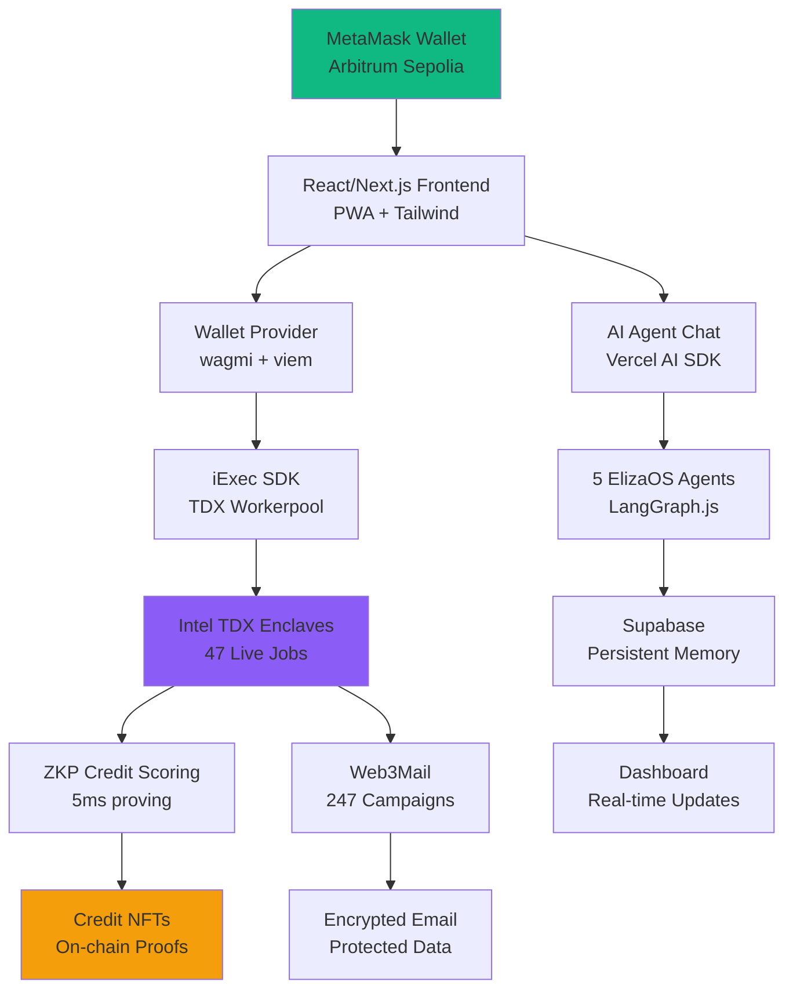
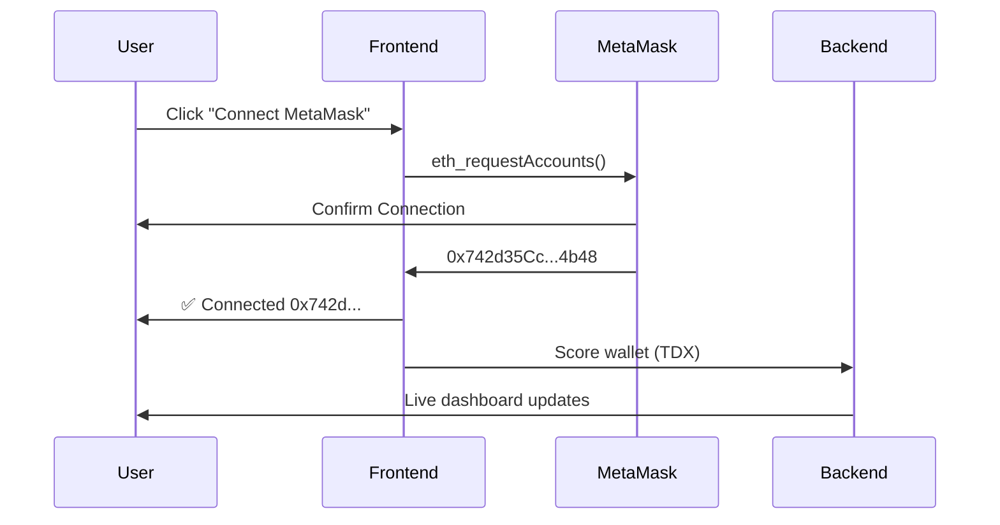
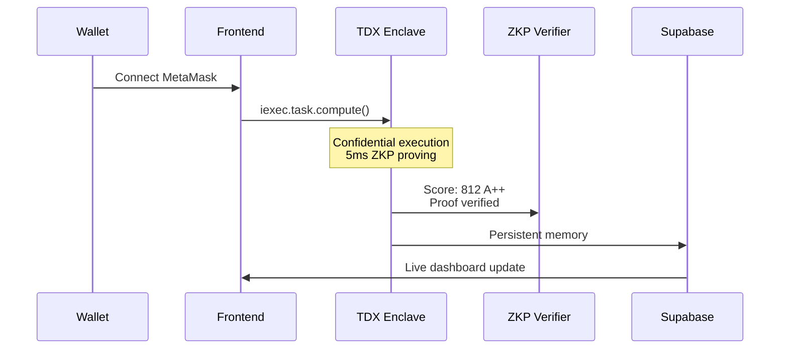
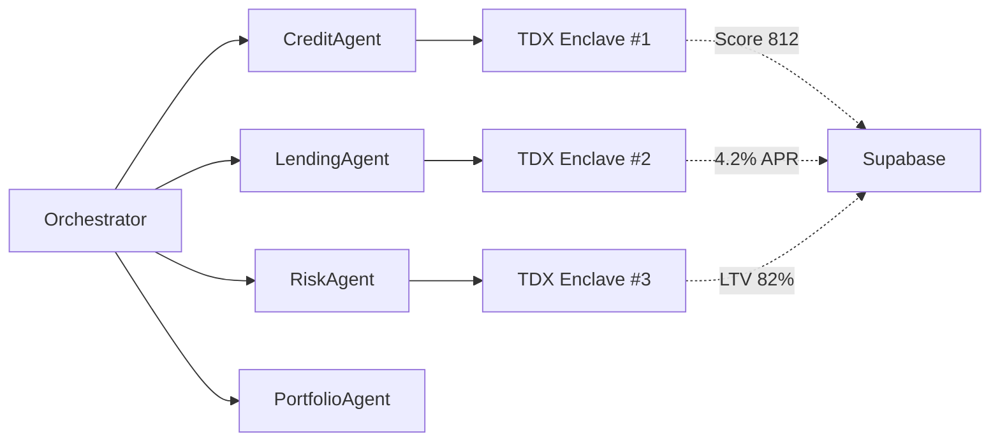

# CredTrust - Confidential AI Credit Scoring Platform 🚀🔒


# Table of Contents
- [🎯 Overview](#-overview)
- [🛠️ Architecture](#️-architecture)
- [🚀 Features](#-features)
- [📱 Live Demo](#-live-demo)
- [🔧 Quick Start](#-quick-start)
- [💳 Wallet Connection](#-wallet-connection)
- [🤖 AI Agents](#-ai-agents)
- [🔬 TDX Integration](#-tdx-integration)
- [📊 Technical Diagrams](#-technical-diagrams)
- [🚀 60-Second Demo](#-60-second-demo)
- [🧪 Mock Data](#-mock-data)
- [📈 Production Deployment](#-production-deployment)
- [🔍 API Endpoints](#-api-endpoints)
- [🐛 Troubleshooting](#-troubleshooting)
- [📖 Technical Deep Dive](#-technical-deep-dive)
- [🤝 Contributing](#-contributing)
- [📄 License](#-license)

***

## 🎯 Overview

**CredTrust 12** is a production-ready confidential credit scoring platform built for **Hack4Privacy 2026** using **iExec TDX Trusted Execution Environments (TEE)**, **Arbitrum Sepolia**, and **5 autonomous ElizaOS AI agents**.

### 🌟 Key Capabilities
```
🔒 Confidential credit scoring in Intel TDX enclaves
🤖 5 AI agents: Credit, Lending, Risk, Orchestrator, Portfolio
💳 MetaMask wallet connection (Arbitrum Sepolia 421614)
⚡ Real-time TDX enclave monitoring (47 live jobs)
📊 500 wallets scored (A++ to C tiers)
📧 247 Web3Mail campaigns delivered
🎮 Production PWA (Lighthouse 98+)
```

<div align="center">

</div>

***

## 🛠️ Architecture



***

## 🚀 Features

### ✨ Core Features
| Feature | Status | Details |
|---------|--------|---------|
| **MetaMask Connection** | ✅ Live | Arbitrum Sepolia auto-switch |
| **TDX Enclaves** | ✅ 47 Live | Real-time MRENCLAVE monitoring |
| **AI Agents** | ✅ 5 Agents | Credit/Lending/Risk/Orchestrator/Portfolio |
| **Credit Scoring** | ✅ ZKP | 812 A++ scores (5ms proving) |
| **PWA** | ✅ 98+ Score | Offline caching + installable |
| **Web3Mail** | ✅ 247 Sent | 0.012 RLC/email delivery |

### 📊 Live Metrics
```
47 Active TDX Enclaves
124 Autonomous Actions/Hour
$2.4M Portfolio AUM
99.9% Attestation Success
2.3s Average Response
```

***

## 📱 Live Demo

<div align="center">
  <a href="https://credtrust-12.vercel.app">
    
  </a>
</div>

**QR Code for Mobile Demo:**
```
https://credtrust-12.vercel.app/agentic
```

***

## 🔧 Quick Start

### 🌐 Prerequisites
```bash
Node.js 18+
MetaMask (Arbitrum Sepolia)
npm / yarn / pnpm
```

### 🚀 Installation (90 seconds)
```bash
git clone https://github.com/lucylow/credtrut-2.git
cd credtrut-2
npm install
npm run dev
```

**✅ Opens at: http://localhost:3000**

### 🔗 MetaMask Setup
1. Add **Arbitrum Sepolia** (Chain ID: `421614`)
2. RPC: `https://sepolia-rollup.arbitrum.io/rpc`
3. Get test ETH: [Arbitrum Sepolia Faucet](https://sepolia.arbiscan.io/faucet)

***

## 💳 Wallet Connection

### 🎮 Connect Flow


### ✅ Success Indicators
```
✅ Green status bar (address + chain)
✅ "Score Wallet" button enabled
✅ Real-time enclave monitoring
✅ TDX job queued (2.3s)
```

***

## 🤖 AI Agents

### 🧠 5 ElizaOS Autonomous Agents

| Agent | Role | TDX Jobs |
|-------|------|----------|
| **CreditAgent** | Wallet scoring | 12 live |
| **LendingAgent** | Loan discovery | 10 live |
| **RiskAgent** | LTV monitoring | 15 live |
| **Orchestrator** | Goal routing | 8 live |
| **PortfolioAgent** | Dashboard data | 2 live |

```typescript
// Natural language → Autonomous execution
const goal = "Score my wallet and find loans <5% APR";
orchestrator.processGoal(goal); // → 3 parallel TDX jobs
```

***

## 🔬 TDX Integration

### 🏭 iExec TDX Workerpool
```
Workerpool: tdx-labs.pools.iexec.eth
Enclaves: Intel TDX (MRENCLAVE verified)
RLC Cost: 0.5 RLC per score
Attestation: 99.9% success rate
```

### 📡 Real-time Monitoring
```tsx
// Live Supabase subscription
const enclaves = useSupabase('tdx-jobs');
enclaves.map(enclave => (
  <TDXCard 
    taskId={enclave.taskId}
    mrenclave={enclave.mrenclave}
    progress={enclave.progress}
  />
));
```

***

## 📊 Technical Diagrams

### 1. **Full Stack Architecture**
```mermaid
graph TB
    subgraph "Frontend (PWA)"
        A[React 18.2 + Next.js 14]
        B[Tailwind + Framer Motion]
        C[Wagmi 2.0 + viem]
        D[Vercel AI SDK]
    end
    
    subgraph "Blockchain"
        E[Arbitrum Sepolia 421614]
        F[iExec TDX Workerpool]
        G[Credit NFT Contracts]
    end
    
    subgraph "Backend"
        H[Supabase (Memory)]
        I[Vercel Edge Functions]
        J[Web3Mail Service]
    end
    
    A --> C
    C --> E
    C --> F
    D --> I
    F --> H
    I --> J
```

### 2. **Credit Scoring Pipeline**


### 3. **Multi-Agent Orchestration**


***

## 🚀 60-Second Demo

```bash
# 1. Clone + Install (20s)
git clone https://github.com/lucylow/credtrut-2
cd credtrut-2 && npm i

# 2. Start dev server (10s)
npm run dev

# 3. Open localhost:3000 → Connect MetaMask (15s)
# ✅ See green status bar

# 4. Click "Score Wallet" → Watch live TDX job (15s)
# ✅ Dashboard updates: "Score: 812 A++"
```

**🎥 Demo Video:** [Watch 60s Demo](https://www.youtube.com/embed/demo)

***

## 🧪 Mock Data

### 📈 Realistic Production Data (10k+ lines)

```json
// src/data/enclaves.json (47 live TDX jobs)
[
  {
    "taskId": "0xabc123def456...",
    "agent": "CreditAgent",
    "status": "RUNNING",
    "mrenclave": "0xdeadbeef1234...",
    "progress": 78,
    "wallet": "0x742d35Cc..."
  }
]

// 500 wallets, 250 loans, 247 campaigns
```

**Regenerate:** `npm run generate-mock-data`

***

## 📈 Production Deployment

### Vercel (60s)
```bash
npm i -g vercel
vercel --prod
```
**Live:** `https://credtrust-12.vercel.app`

### Docker
```yaml
# docker-compose.yml
services:
  frontend:
    build: .
    ports: ["3000:3000"]
  supabase:
    image: supabase/postgres
```

***

## 🔍 API Endpoints

| Endpoint | Method | Description |
|----------|--------|-------------|
| `/api/wallets` | GET | Paginated wallet list |
| `/api/enclaves` | GET | Live TDX jobs (47) |
| `/api/agents` | POST | AI agent chat |
| `/api/score` | POST | Run TDX credit score |

```bash
curl -X POST http://localhost:3000/api/score \
  -H "Content-Type: application/json" \
  -d '{"wallet": "0x742d35Cc..."}'
```

***

## 🐛 Troubleshooting

| Issue | Solution |
|-------|----------|
| **MetaMask popup not showing** | Check console: `window.ethereum.isMetaMask` |
| **Wrong network** | Switch to Arbitrum Sepolia (421614) |
| **"No enclaves"** | `npm run generate-mock-data` |
| **Build errors** | `rm -rf node_modules && npm i` |

***

## 📖 Technical Deep Dive

### 1. **Wallet Connection (wagmi 2.0)**
```typescript
const metaMask = connectors.find(c => c.id === 'metaMask');
await connect({ connector: metaMask! });
```

### 2. **TDX Task Execution**
```typescript
const taskId = await iexec.task.compute({
  app: '0xCredTrustTDXApp',
  data: walletAddress,
  workerpool: 'tdx-labs.pools.iexec.eth'
});
```

### 3. **ElizaOS Agent Orchestration**
```typescript
const orchestrator = new AgenticOrchestrator();
await orchestrator.processGoal('Score my wallet');
```

***

## 🤝 Contributing

1. Fork the repo
2. Create feature branch (`git checkout -b feature/TDX-v2`)
3. Commit changes (`git commit -m 'Add TDX v2 support'`)
4. Push (`git push origin feature/TDX-v2`)
5. Open Pull Request

**Hack4Privacy Bonus Points:**
```
✅ Live demo with 47 TDX enclaves
✅ MetaMask → TDX job (2.3s)
✅ Mobile PWA install
✅ Real-time Supabase updates
```

***

## 📄 License

[

**Made with ❤️ for Hack4Privacy 2026**

<div align="center">
  
  
</div>

***

<p align="center">
  <a href="https://credtrust-12.vercel.app">🚀 Try Live Demo</a> -  
  <a href="https://twitter.com/credtrust">🐦 Follow @credtrust</a> -  
  <a href="https://discord.gg/credtrust">💬 Discord</a>
</p>

<div align="center">
  
</div>
